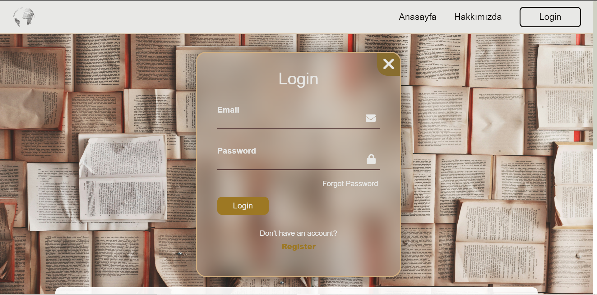
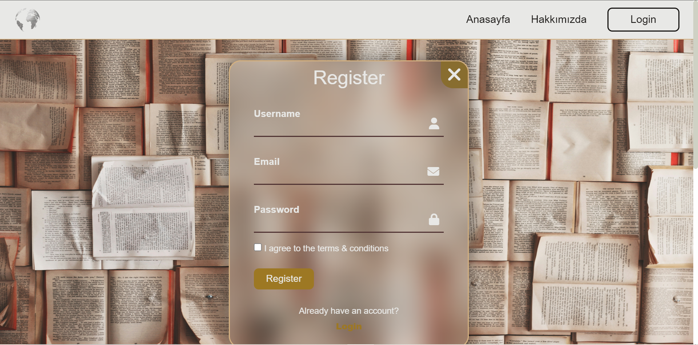
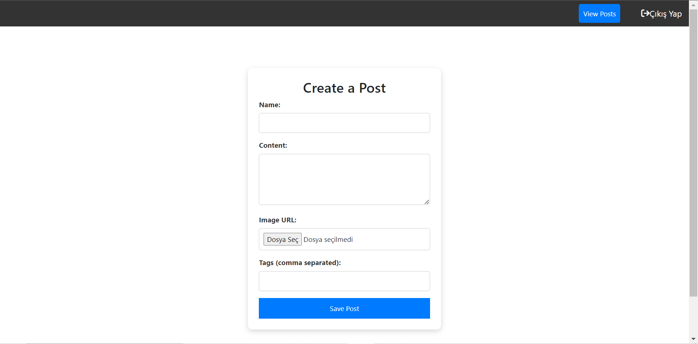
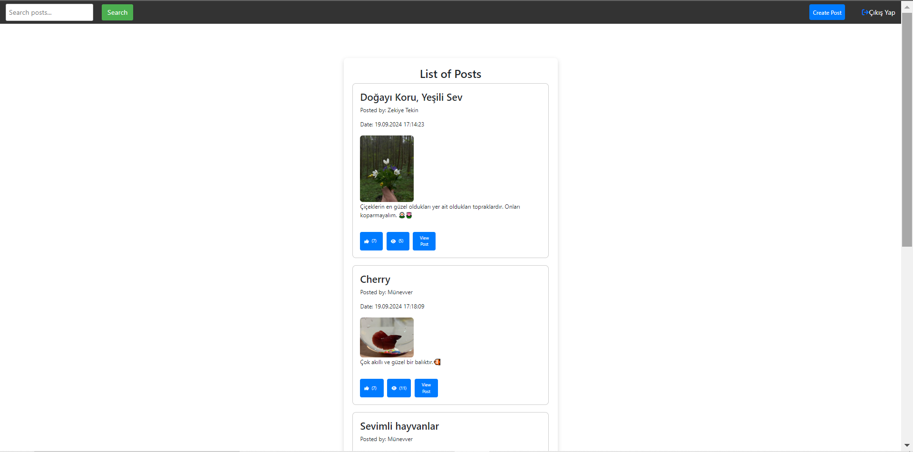
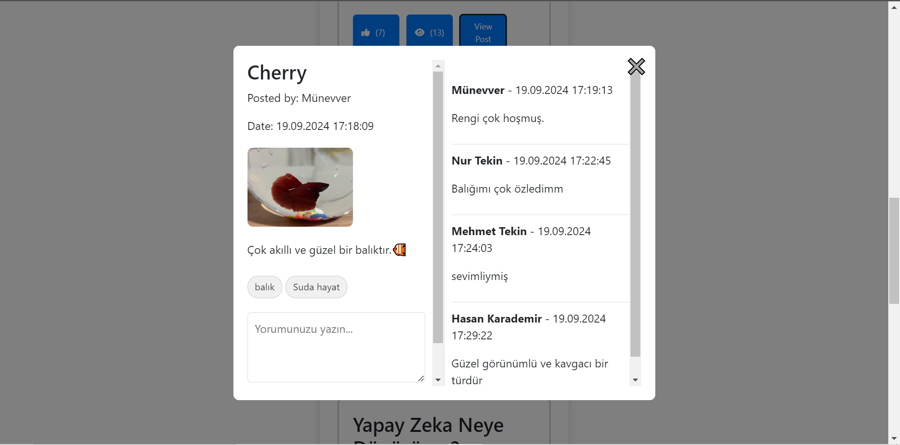
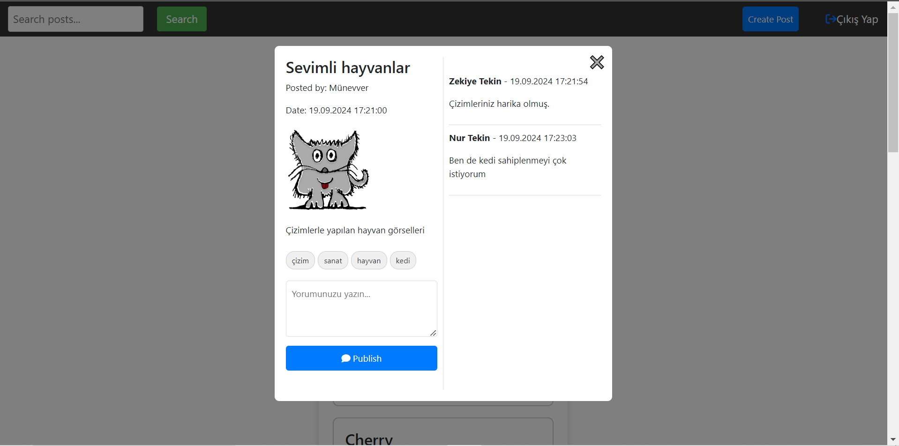
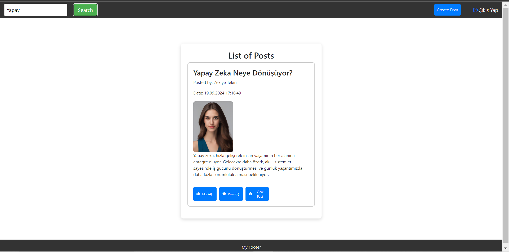

# Online Blogging Project - Frontend

## İçindekiler
- [Proje Amacı](#proje-amacı)
- [Özellikler](#özellikler)
- [Teknik Detaylar](#teknik-detaylar)
- [Proje Görünümü](#proje-görünümü)
- [Kullanım](#kullanım)

## Proje Amacı

**Online Blogging**, kullanıcıların özgürce içerik paylaşabilecekleri, paylaşılan postları beğenebilecekleri ve yorum yapabilecekleri bir platformdur. 

Bu proje, kullanıcıların fikirlerini, düşüncelerini ve yaratıcı içeriklerini geniş bir kitleyle paylaşmasını amaçlar. 

Aynı zamanda, kullanıcı etkileşimlerini teşvik eden beğeni ve yorum sistemi ile interaktif bir ortam sunmayı hedeflemektedir.

## Özellikler
### 1. Post Paylaşımı
- Kayıtlı kullanıcılar, blog yazılarını (post) oluşturabilir ve yayınlayabilir.
- Her post, bir başlık (name), içerik (content), yazan kişi (postedBy), ve tarih (date) bilgilerini içerir.

### 2. Beğenme (Like) ve Yorum Yapma
- **Giriş yapmış kullanıcılar**, postları beğenebilir ve yorum yapabilir.
- **Giriş yapmamış kullanıcılar**, postları yalnızca görüntüleyebilir ancak beğeni ve yorum işlemleri yapamaz.

### 3. Post Detayları
- Her postun **beğeni sayısı** (likeCount) ve **görüntülenme sayısı** (viewCount) tutulur.
- Detay sayfasına tıklandığında, postun başlığı, içeriği, beğeni ve görüntülenme sayıları gösterilir.
- Detay sayfasında, postu yapan kişinin adı, postun tarihi ve yorumlar (yorum yapan kişi, tarih ve yorum içeriği) de yer alır.

### 4. Yorum Sistemi
- Yalnızca giriş yapmış kullanıcılar postlara yorum yapabilir.
- Yorumlar, yorum yapan kişi, tarih ve içerik bilgilerini içerir.

### 5. Arama (Search) İşlevi
- Kullanıcılar, **post başlıklarına** göre arama yapabilir.
- Arama sonuçları, sadece ilgili postları listeler.
- User registration and authentication
- Create, edit, and delete blog posts
- Upload images for posts
- Search functionality for posts by title or content
- Responsive design

## Teknik Detaylar
- Backend: **Spring Boot**
- Frontend: **HTML/CSS/JavaScript**
- Veritabanı: **PostgreSQL**
- Kimlik Doğrulama: **JWT Token**

## Proje Görünümü

| Description    | Screenshot                    |
|----------------|-------------------------------|
| **Giriş Sayfası**  |   |
| **Kayıt Sayfası** |   |
| **Hakkımızda**  |   |
| **Post Oluşturma**  |   |
| **Postları Listeleme**  |   |
| **Post Detaylarını Görüntüleme 1**  |   |
| **Post Detaylarını Görüntüleme 2**  |   |
| **Postları Başlığa Göre Arama ve Listeleme**  |   |

